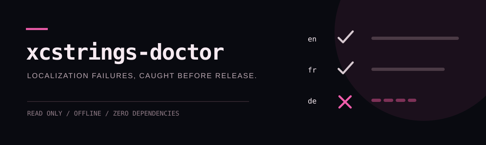

<div align="center">
  
</div>

# xcstrings-doctor

Make broken Xcode localization fail in CI, not in front of a user.

`xcstrings-doctor` audits Apple String Catalogs for missing locales, unfinished translations, printf placeholder drift, plural and substitution variations, stale entries, and misleading completion totals. It is read-only, offline, and has zero runtime dependencies.

## Quick start

```bash
npx --yes github:hehehe224/xcstrings-doctor ./MyApp
```

Require a complete Canadian French catalog even when `fr-CA` is absent everywhere:

```bash
npx --yes github:hehehe224/xcstrings-doctor . --locale fr-CA --fail-under 100
```

Healthy catalogs exit `0`. Catalog errors or completion below the chosen threshold exit `1`. Invalid CLI usage and unreadable targets exit `2`.

## What it catches

- A locale missing from one key—or from the entire catalog when required with `--locale`
- Empty translations and Xcode units not marked `translated`
- Drift in `%@`, `%lld`, positional, width, precision, and String Catalog substitution placeholders
- Placeholder defects inside plural, device, and substitution variations
- Entries Xcode marks `stale`
- Translations attached to entries marked non-translatable
- Invalid JSON and directories containing no `.xcstrings` files

The completion percentage is based on translatable key/locale pairs. Excluded locales and non-translatable entries do not inflate the denominator.

## CLI

```text
xcstrings-doctor [path] [options]

  --fail-under N       minimum translation completion (default: 100)
  --exclude LOCALE     exclude a locale; repeatable
  --locale LOCALE      require a locale; repeatable
  --ignore-stale       do not warn about stale entries
  --json               machine-readable report
  --github             GitHub Actions annotations
```

Locales are normally discovered across every key in each catalog. Use repeatable `--locale` flags for languages that must exist even if no key currently contains them.

## GitHub Actions

```yaml
name: Localization
on: [push, pull_request]

jobs:
  xcstrings:
    runs-on: macos-latest
    steps:
      - uses: actions/checkout@v4
      - uses: actions/setup-node@v4
        with:
          node-version: 22
      - run: npx --yes github:hehehe224/xcstrings-doctor . --locale fr-CA --github
```

`--github` emits native workflow annotations. `--json` produces a stable report shape for custom dashboards or build tooling.

## Programmatic use

```js
import { auditPath } from "xcstrings-doctor";

const report = await auditPath("./MyApp", {
  locales: ["fr-CA"],
  excludeLocales: ["en-GB"],
  ignoreStale: false
});

if (report.errors > 0) process.exitCode = 1;
```

The package also exports `auditCatalog`, `formatHuman`, and `formatGitHub`.

## Scope

The doctor checks catalog structure and translation state; it does not judge linguistic quality, call a translation service, edit files, or replace Xcode's localization workflow. Plural categories legitimately differ between languages, so placeholder checks compare each target variation with the closest source variation and fall back to the source `other` form.

## Common questions

### How do I fail CI for incomplete Xcode String Catalog localization?

Run `xcstrings-doctor` in CI with every required locale and the completion threshold you enforce:

```bash
npx --yes github:hehehe224/xcstrings-doctor . --locale fr-CA --fail-under 100 --github
```

The command exits `1` for catalog errors or completion below the threshold and emits GitHub Actions annotations with `--github`.

### What does this add beyond Xcode's localization interface?

Xcode is where teams author and inspect String Catalogs. `xcstrings-doctor` adds a repeatable, read-only CI check across catalogs, explicit required locales, stable machine-readable output, and placeholder validation inside plural, device, and substitution variations.

### What is the difference between a missing locale and placeholder drift?

A missing locale means a translation is absent or unfinished for a required language. Placeholder drift means a translation changed or omitted format tokens such as `%@`, `%lld`, positional arguments, or catalog substitutions, which can produce incorrect output or runtime failures even when text appears translated.

Requires Node.js 20 or newer.

## Development

```bash
npm ci
npm run check
npm test
npm pack --dry-run
```

The test suite includes real-shape String Catalog fixtures and CLI exit-code coverage.

## License and identity

Code is licensed under [AGPL-3.0-only](LICENSE). See [SECURITY.md](SECURITY.md) for private vulnerability reporting and [TRADEMARKS.md](TRADEMARKS.md) for the separately reserved project name and artwork.

Contributions are welcome; see [CONTRIBUTING.md](CONTRIBUTING.md).
